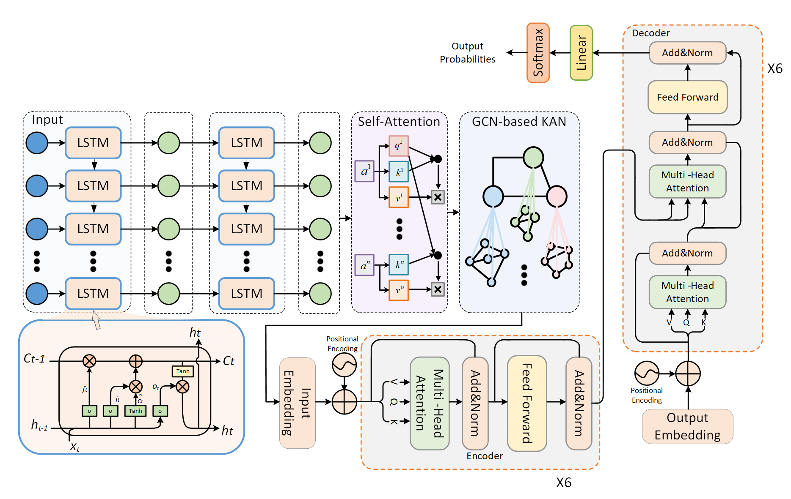
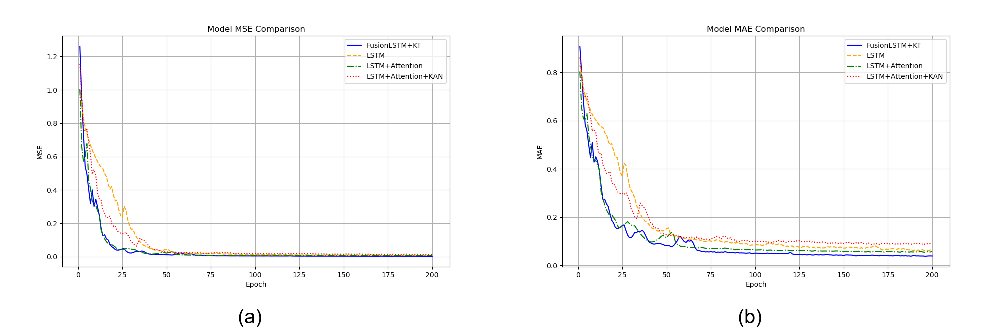
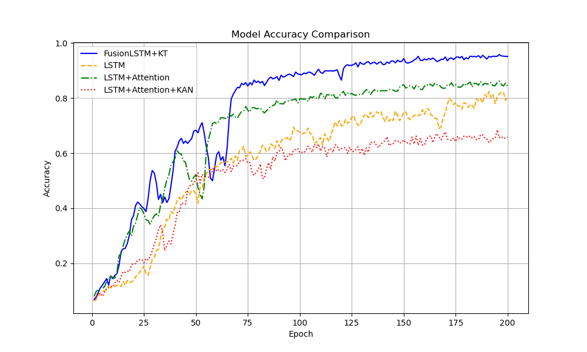

# 📈 FusionLSTM-KT: A Robust Framework for Time Series Forecasting

> A hybrid deep learning model that fuses LSTM, Attention, Knowledge Graphs (KAN), and Transformer to tackle long-range dependencies and external interference in time series data.

---

## 🧠 Motivation

Time series forecasting is essential in domains like energy, finance, traffic, and meteorology. However, it faces three main challenges:

1. **Long-Term Dependencies**: Traditional RNN/LSTM struggle to retain distant temporal information.
2. **Complex Dynamics**: Non-linear, high-dimensional, and irregular patterns in real-world time series.
3. **External Influences**: Events like policy shifts, weather changes, and holidays that affect forecasting accuracy.

**FusionLSTM-KT** is designed to address all of the above through a multi-module neural network that blends memory, attention, and knowledge integration.

---

## 📦 Project Structure

```bash
FusionLSTM_KT/
├─ dataset/                                   
├─ experiment/                  
│  ├─ Ablation_experiment/     
│  ├─ Compare_experiment/     
│  └─ model/                
├─ utils/                      
├─ README.md                    
└─ requirements.txt     
```

⚙️ Installation & Requirements

```bash
pip install -r requirements.txt
```

## 📊 Datasets

FusionLSTM-KT was evaluated on 5 real-world datasets:

| Dataset     | Timesteps | Features | Granularity |
| ----------- | --------- | -------- | ----------- |
| Traffic     | 17,544    | 862      | Hourly      |
| Weather     | 52,696    | 21       | Every 10min |
| Electricity | 26,304    | 321      | Hourly      |
| ETTh1/2     | 17,420    | 7        | Hourly      |
| ETTm1/2     | 69,680    | 7        | Every 5min  |

You can download the dataset from the network disk:
Link: https://pan.baidu.com/s/1PI6L6hlmENXuY2ervCMxcg?pwd=cpxt 
Extraction code: cpxt 
https://www.kaggle.com/datasets/anonuymous/dataset-of-fusionlstm-kt-project/data
Or you can download the complete dataset from Kaggle：
https://www.kaggle.com/datasets/anonuymous/dataset-of-fusionlstm-kt-project/data

## 🧱 Model Architecture

FusionLSTM-KT consists of 4 components:

1. **LSTM Layers**: Extract temporal features.
2. **Self-Attention**: Focuses on key timesteps.
3. **KAN (Graph Embedding)**: Integrates external knowledge via GCN.
4. **Transformer (Multi-Head Attention)**: Fuses contextual + global signals.



🔍 Evaluation



                                                                             

​                                                                    Ablation Experiment Results

